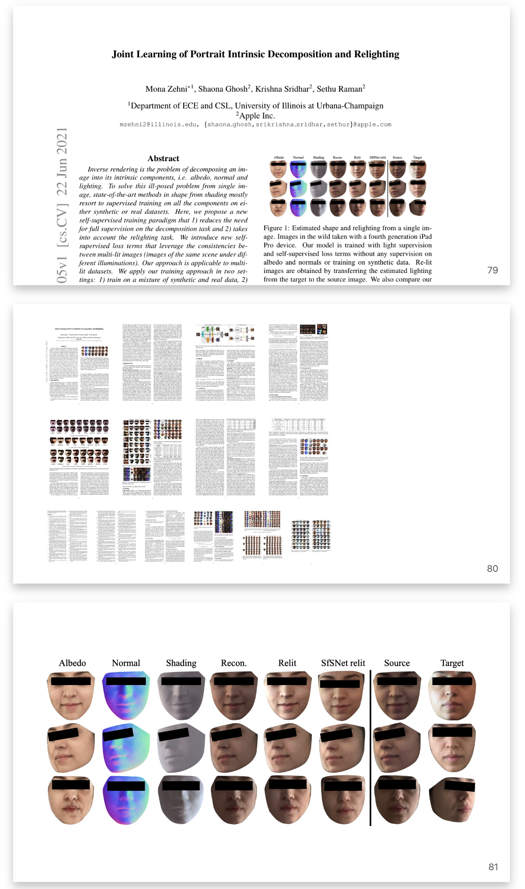
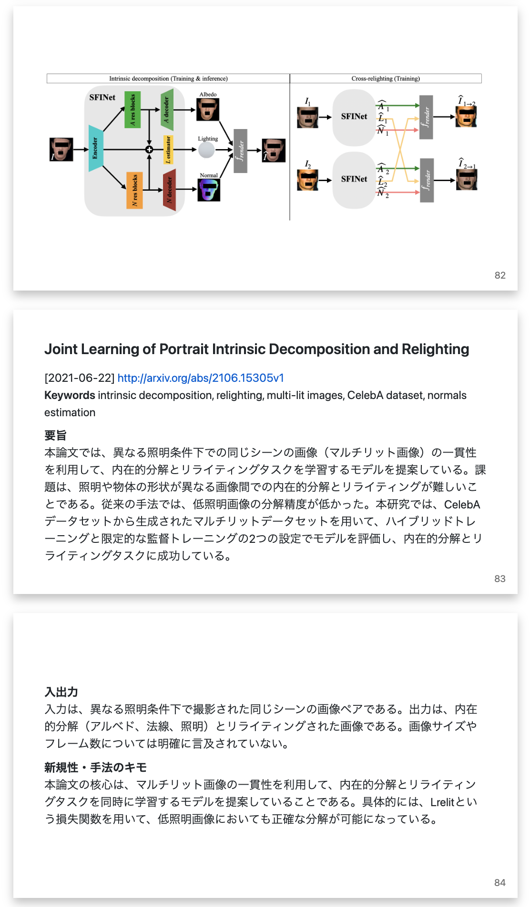
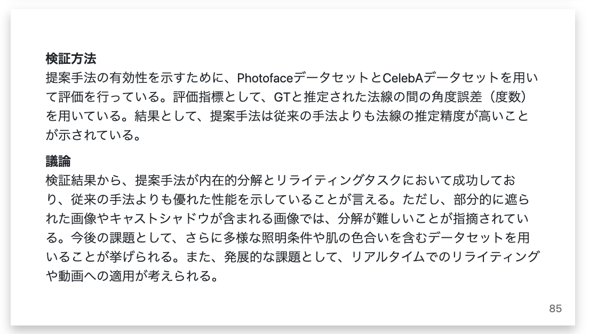

# Summarize arXiv paper with figures
Forked repository from https://github.com/rkmt/summarize_arxv  
This tool searches for arXiv articles and generates a markdown file containing article summaries and images using GPT.
The markdown files are compatible with Marp, allowing for slide presentations in VS Code.  
  
Differences from the original repository include:
1. In the original repository, only the paper's abstract was provided to GPT for summarization. In this fork, __the entire texts of a paper (excluding images) are given for summarization__.
2. The original repository outputs a specified number of article images, while this fork outputs the first two images in order of appearance. This is based on experimental findings that the initial two images often represent the paper's summary and overall methodology.
3. In this fork, all pages of the paper are condensed into a single slide for easier comprehension of the overall content.
4. The prompt for GPT has been modified. (You can change the prompt in the Python file)

## How to use
Search articles from arXiv by keywords, create summaries by GPT and save as xml.  
Please set your OpenAI API key in OPENAI_API_KEY.  
Note1: Since we use OpenAI embedding to give the entire paper, there is an additional cost beyond the summarization.  
Note2: Which GPT model to summarize can be changed at the top of the Python file. The default is `gpt-4`.

```sh
$ python query_arxiv.py  [-d directory] [-n num-papers] [-y from-year] --api_key YOUR_OPENAI_KEY "search keywords"  
```

Create slides (markdown) from xml.
Note: keyword is used to title of the slide.
```sh
# "directory" is a directory where xml files are saved
$ python mkmd.py [-o output.md] [-d directory] "keyword"
```
The generated ***.md file supports Marp (https://marketplace.visualstudio.com/items?itemName=marp-team.marp-vscode), so if you load it with VS Code, you can view it as a slide format or you can save it as a PDF file.


## Output slide sample
Screenshots of VS code.  





## ToDo
- [ ] Clarify license
  - This repository is also undefined because no license was added to the original repository. The configuration must be consistent with the original author's intentions and the compatibility of the dependent libraries and licenses. In particular, be aware of the licenses of the following libraries:
    - PyMuPDF: GNU Affero General Public License v3.0 (AGPL-3.0)
    - dicttoxml: GNU General Public License v2.0 (GPL-2.0)
    - hnswlib: License is unknown.
- [ ] Measures when the response by GPT is cut off in the middle
  - Since the response by GPT may be cut off in the middle, countermeasures against this are necessary. Currently, "None" is entered if the summary item required for the response is missing.
